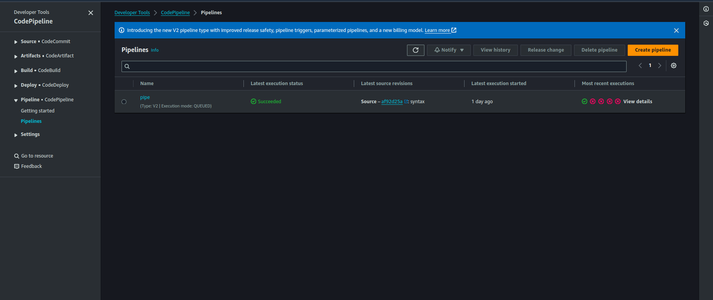
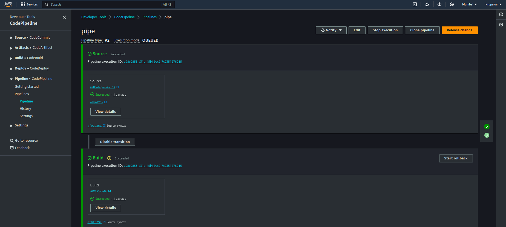
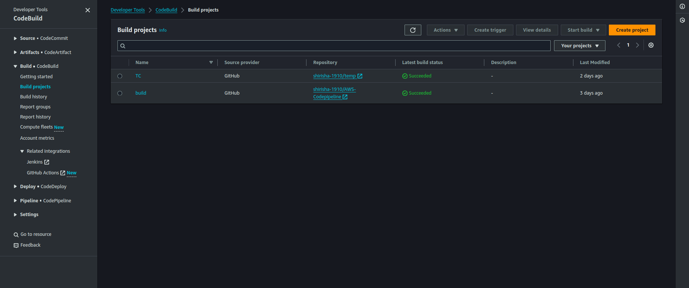
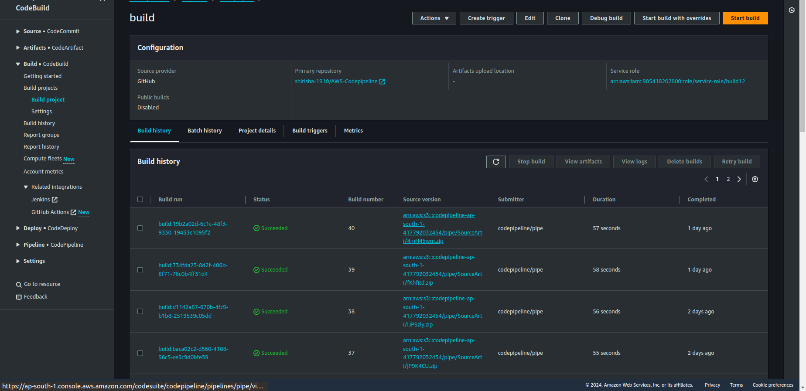
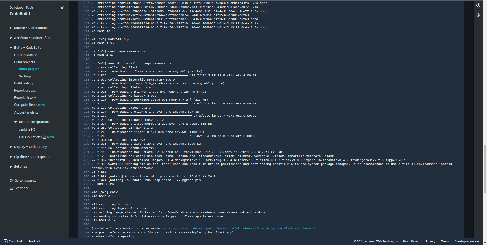
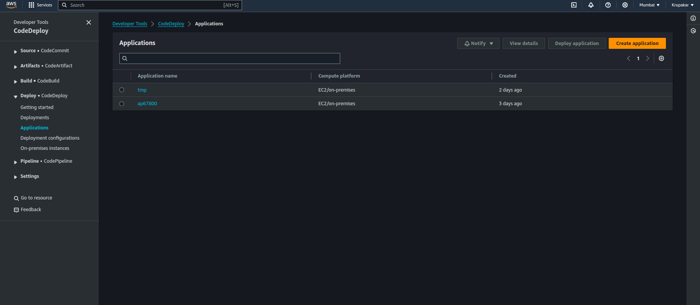
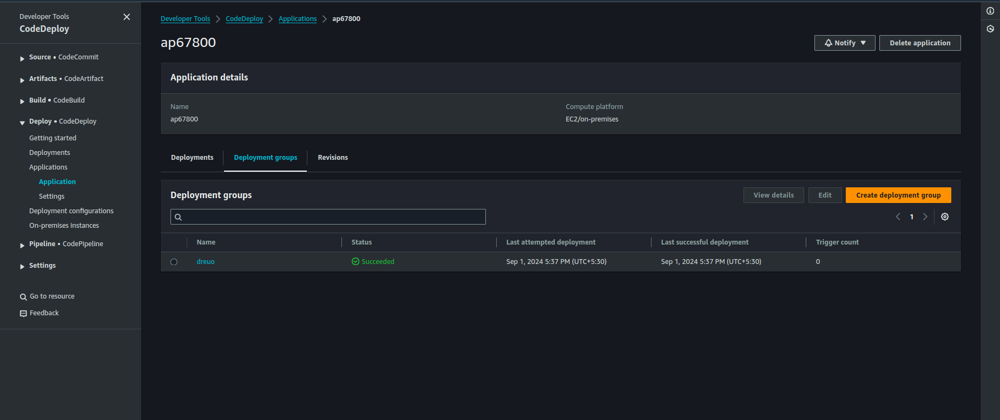
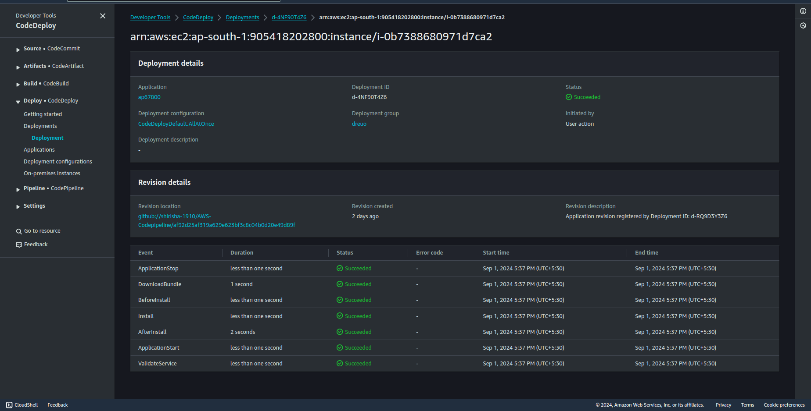
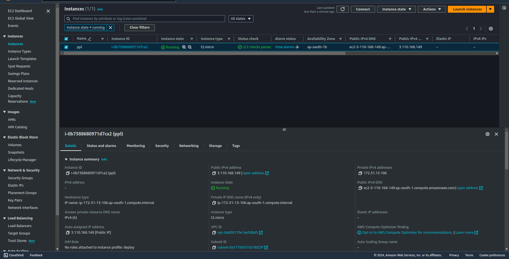
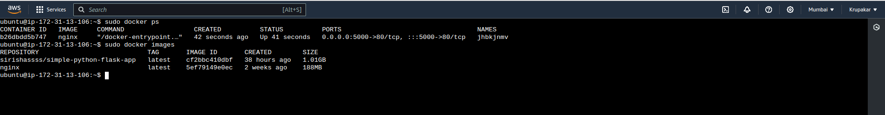

# AWS-Codepipeline
## AWS Continuous Integration Demo
## 1. Set Up GitHub Repository
Set up a GitHub repository to store our Python application's source code. Let's create a new repository on GitHub by following these steps:

Go to github.com and sign in to your account.
Click on the "+" button in the top-right corner and select "New repository."
Give a repository a name and an optional description.
Initialize the repository with a README file.
Click on the "Create repository" button to create a new GitHub repository.

## 2. Create an AWS CodePipeline
we'll create an AWS CodePipeline to automate the continuous integration process for our Python application. AWS CodePipeline will orchestrate the flow of changes from our GitHub repository to the deployment of our application.

- Go to the AWS Management Console and navigate to the AWS CodePipeline service.
- Click on the "Create pipeline" button.
- Provide a name for pipeline and click on the "Next" button.
- For the source stage, select "GitHub" as the source provider.
- Connect GitHub account to AWS CodePipeline and select your repository.
- Choose the branch to use for pipeline.
- In the build stage, select "AWS CodeBuild" as the build provider.
- Create a new CodeBuild project by clicking on the "Create project" button.
- Configure the CodeBuild project with the necessary settings for Python application, such as the build environment, build commands.
- Save the CodeBuild project and go back to CodePipeline.
- Continue configuring the pipeline stages.
- Review the pipeline configuration and click on the "Create pipeline" button to create your AWS CodePipeline.
  
  ### Final View of Codepipeline
  
  
  

## 2. Configure AWS CodeBuild
Here, we'll configure AWS CodeBuild to build Python application based on the specifications we define. CodeBuild will take care of building and packaging our application for deployment. Follow these steps:

- In the AWS Management Console, navigate to the AWS CodeBuild service.
- Click on the "Create build project" button.
- Provide a name for build project.
- For the source provider, choose "AWS CodePipeline."
- Select the pipeline created in the previous step.
- Configure the build environment, such as the operating system, runtime, and compute resources required for Python application.
- Specify the build commands, such as installing dependencies and running tests. Customize this based on application's requirements.
- Set up the artifacts configuration to generate the build output required for deployment.
- Review the build project settings and click on the "Create build project" button to create AWS CodeBuild project.
  
  
  

## 3. Configure AWS CodeDeploy
Here, we'll configure AWS CodeDeploy to deploy Python application based on the specifications we define. CodeDeploy will take care of deploying  our application. Follow these steps:

- In the AWS Management Console, navigate to the AWS CodeDeploy service.
- Click on the "Create Application" button.
- Provide a name for it.
- Then create a Deployment group.
- Then after create deployment and run.

  
  
  
 
- Create EC2 instance and attach policie CodeDeploy then attach it to CodeDeploy Service.
  
 

 

## 4. Trigger the CI Process
Here, we'll trigger the CI process by making a change to our GitHub repository:

- Go to GitHub repository and make a change to your Python application's source code. It could be a bug fix, a new feature, or any other change which we want to introduce.
- Commit and push changes to the branch configured in your AWS CodePipeline.
- Head over to the AWS CodePipeline console and navigate to your pipeline.
- we should see the pipeline automatically kick off as soon as it detects the changes in your repository.
